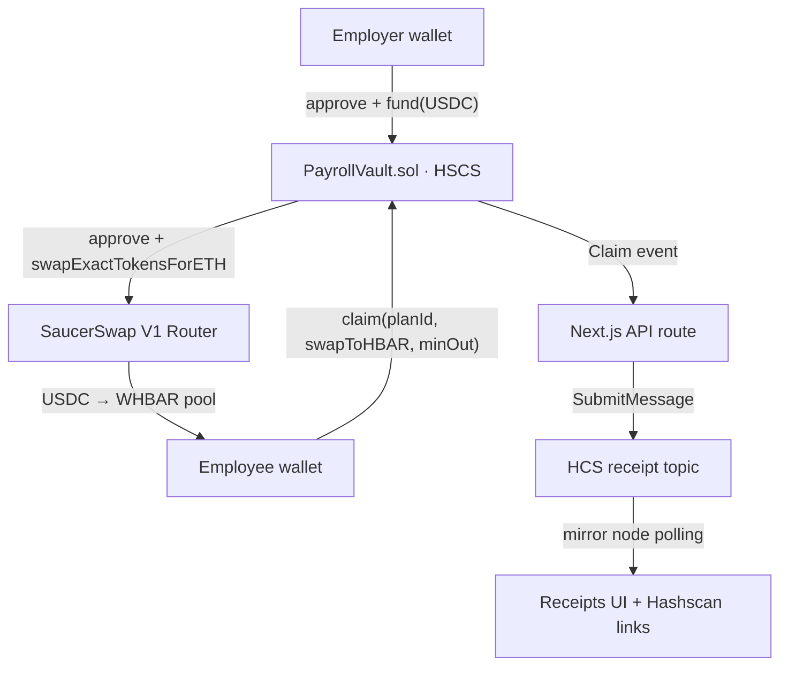

# StreamPay

> **Verified on Hedera Testnet:**
> - **Smart Contract:** [0.0.10840783](https://hashscan.io/testnet/contract/0.0.10840783)
> - **Seed Transfer (Fund):** [View Transaction](https://hashscan.io/testnet/transaction/0x2f9487e91434c4a68fb6c3f63049a17f655fbf1bfadd7713c9fb38fefd36839a)
> - **Salary Claim:** [View USDC Claim](https://hashscan.io/testnet/transaction/0x728a38b02cf5e6ed7383b94e512e450ffede5c3c3e111151d057d8ed75cf1543)
> - **HCS Topic Message:** [View Topic Message](https://hashscan.io/testnet/transaction/0.0.10469716-1791025581-655739693)

StreamPay is a non-custodial, on-chain streaming payroll application on Hedera. Employers fund salary streams denominated in a stablecoin (USDC). Employees accrue their salary linearly every second and can claim it at any time. When claiming, employees can choose to receive the native stablecoin or automatically convert it to HBAR via the SaucerSwap V1 Router. Every claim generates an immutable receipt on the Hedera Consensus Service (HCS), providing a verifiable payroll audit trail.



## Prerequisites

- Node.js ≥ 20.18.3
- Git
- Yarn or npm
- A Hedera Testnet account, which you can fund via the [Hedera Faucet](https://portal.hedera.com).

## Quickstart

1. Scaffold the template:
```bash
npx create-scaffold-hbar@latest --template shinothelegend/hbar-streampay
```

2. Enter the directory and install dependencies:
```bash
cd hbar-streampay
yarn install
```

3. Setup environment variables:
```bash
cp packages/hardhat/.env.example packages/hardhat/.env
cp packages/nextjs/.env.example packages/nextjs/.env
```
Edit both `.env` files with your testnet private keys (see below).

4. Deploy the contracts and seed demo accounts:
```bash
yarn hardhat:deploy --network hederaTestnet
```

5. Start the frontend:
```bash
yarn next:dev
```

## Environment Variables

| Variable | Description | Source |
|----------|-------------|--------|
| `DEPLOYER_PRIVATE_KEY_ENCRYPTED` | Optional encrypted deployer key. | Scaffold-HBAR `account:generate` script. |
| `HEDERA_OPERATOR_ID` | Testnet Account ID (e.g., `0.0.1234`) | Hedera Portal |
| `HEDERA_OPERATOR_KEY` | ECDSA Private Key for NextJS API to submit HCS messages | Hedera Portal |
| `NEXT_PUBLIC_HCS_RECEIPT_TOPIC_ID` | The ID of the HCS topic used for receipts | Run `npm run hardhat:create-topic` or create manually |

## Hedera Services Integration

| Service | Purpose | Hashscan Evidence |
|---------|---------|-------------------|
| **HSCS (Smart Contracts)** | Executes the `PayrollVault.sol` streaming logic and integrations. | [View Deployment](https://hashscan.io/testnet/contract/0.0.10840783) |
| **HTS (Token Service)** | Native performance for USDC transfers and WHBAR. | [View Token Transfer](https://hashscan.io/testnet/transaction/0x728a38b02cf5e6ed7383b94e512e450ffede5c3c3e111151d057d8ed75cf1543) |
| **HCS (Consensus Service)** | Immutable, timestamped receipts for every salary claim. | [View Topic Message](https://hashscan.io/testnet/transaction/0.0.10469716-1791025581-655739693) |

## Why SaucerSwap is Load-Bearing

SaucerSwap is a critical infrastructure component for StreamPay. Without the SaucerSwap V1 Router, the "pay-in-HBAR" feature would be impossible. The `PayrollVault` contract utilizes the router's `swapExactTokensForETH` method to handle the conversion of stablecoins into native HBAR in a single transaction, providing a smooth employee experience.

## Testnet Evidence

The core operations run successfully on the Hedera Testnet. See `docs/TESTNET_EVIDENCE.md` for verifiable Hashscan transaction links for deployments, funds, claims, and notes regarding the testnet HBAR swap execution.

## Project Structure & Testing

- `packages/hardhat/contracts`: Contains `PayrollVault.sol` and interfaces.
- `packages/hardhat/test`: Contains the comprehensive test suite against a local `MockRouter`.
- `packages/nextjs/app`: The Next.js 15 App Router frontend.

To run the local contract tests:
```bash
yarn hardhat:test
```
